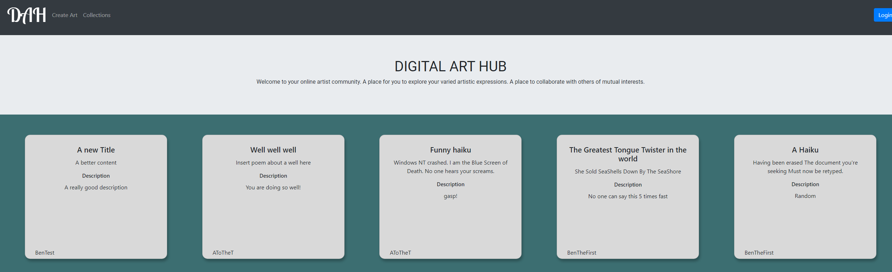
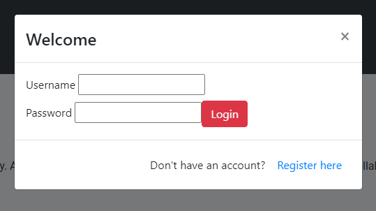
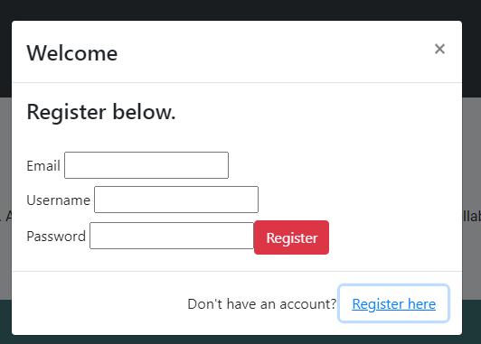
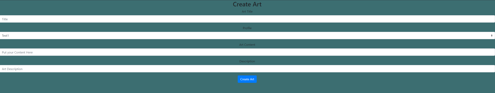
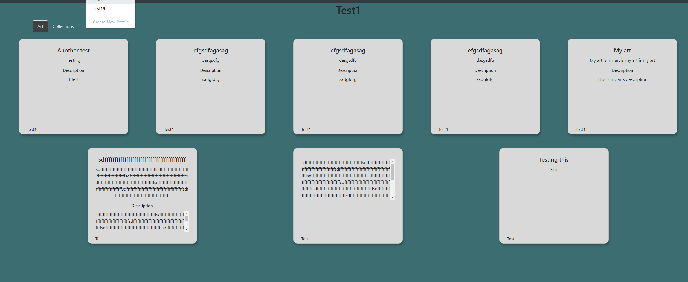
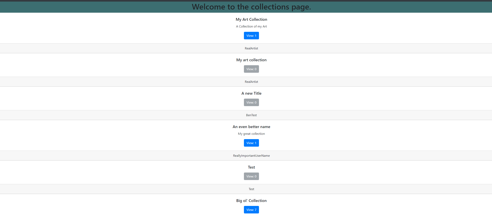

# Digital Arthub

Created and finished by:
- Nathan Hall 
    - [Github](https://github.com/Vavyo)
- Jean McMahon 
    - [Github](https://github.com/jmcia2020)
- Adara Townsend
    - [Github](https://github.com/adard2002)
- Ben Hemann 
    - [Github](https://github.com/Kozer2)

### Links
- [Digital ArtHub frontend](https://github.com/DeltaVArtLibrary/dah-front-end)  
- [Digital ArtHub backend](https://github.com/DeltaVArtLibrary/DigitalArtHub)  
- [Digital ArtHub Azure deployment](https://digitalarthub.azurewebsites.net/index.html)  
- [Digital Arthub Live site](https://digitalarthub.netlify.app/Art)  

Digital ArtHub is a project that was built from the ground up to use a custom made API. The Mid-term project for our 401 course at DeltaV was to build out the API itself. We used Swagger to show the end-points for the API. Out DeltaV final project was to build out the frontend of this API for the user to interact with. During our planning stage we came up with 12 different wireframes for what we pictured the website to look like. We changed these as the week went on, but in general if the page exists, it looks like its wireframe. 

#### The Website

Version: 1.0.0

